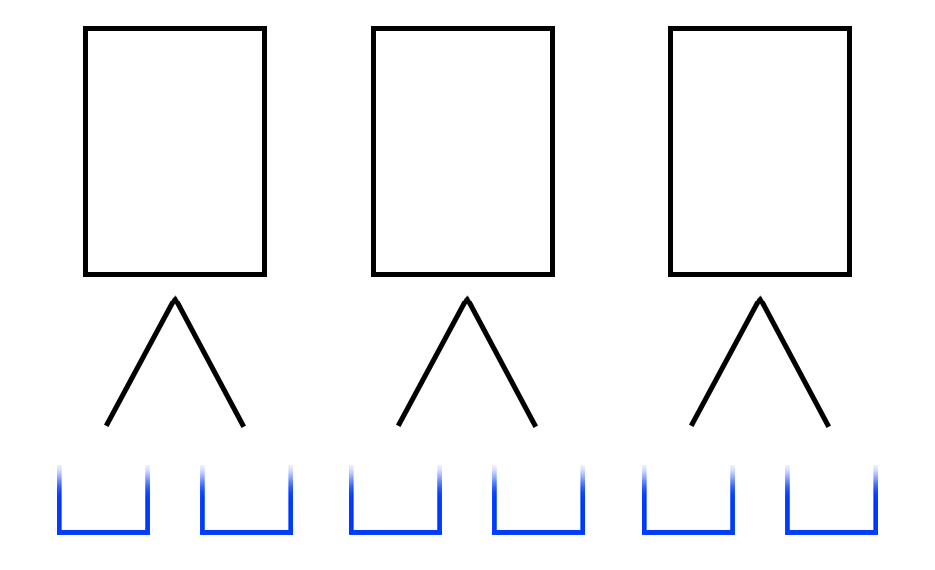

# Combinations algorithm with specific position

Sometimes you need to get all combinations where there is a specific list of members for each positions.

For example, we need to make combinations where the first position can only be 1 or 2, and the second only 3 or 4.

