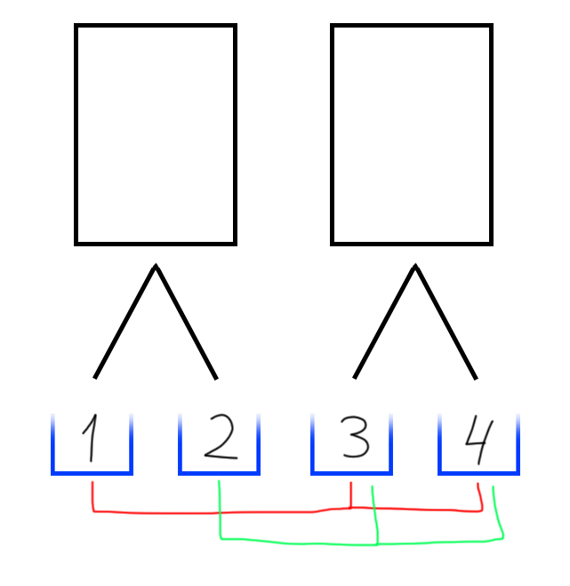

# Combinations algorithm with specific position

Sometimes you need to get all combinations where there is a specific list of members for each positions.


For example, we need to make combinations where the *first* position can only be `1 or 2`, and the *second* only `3 or 4`.

We expect numbers such as `13`, `14`, `23` and `24` in the answer.

The function takes an array, inside which the possible elements should be placed in positions.

```python
array = [ [1, 2], [3, 4] ]

Out >> ['13', '14', '23', '24']
```



```python
array = [ ["A", "B"], ["C", "D", "E"], ["F", "G"] ]

Out >> ['ACF', 'ACG', 'ADF', 'ADG', 'AEF', 'AEG', 'BCF', 'BCG', 'BDF', 'BDG', 'BEF', 'BEG']
```
```python
array = [ ["A1 ", "A2 "], ["B1 ", "B2 "], ["C1 ", "C2 "] ]

Out >> ['A1 B1 C1 ', 'A1 B1 C2 ', 'A1 B2 C1 ', 'A1 B2 C2 ', 'A2 B1 C1 ', 'A2 B1 C2 ', 'A2 B2 C1 ', 'A2 B2 C2 ']
```
